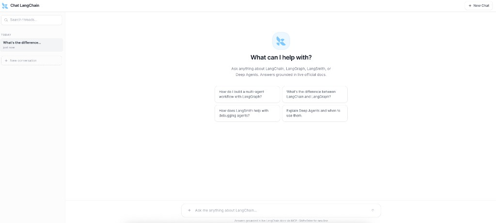
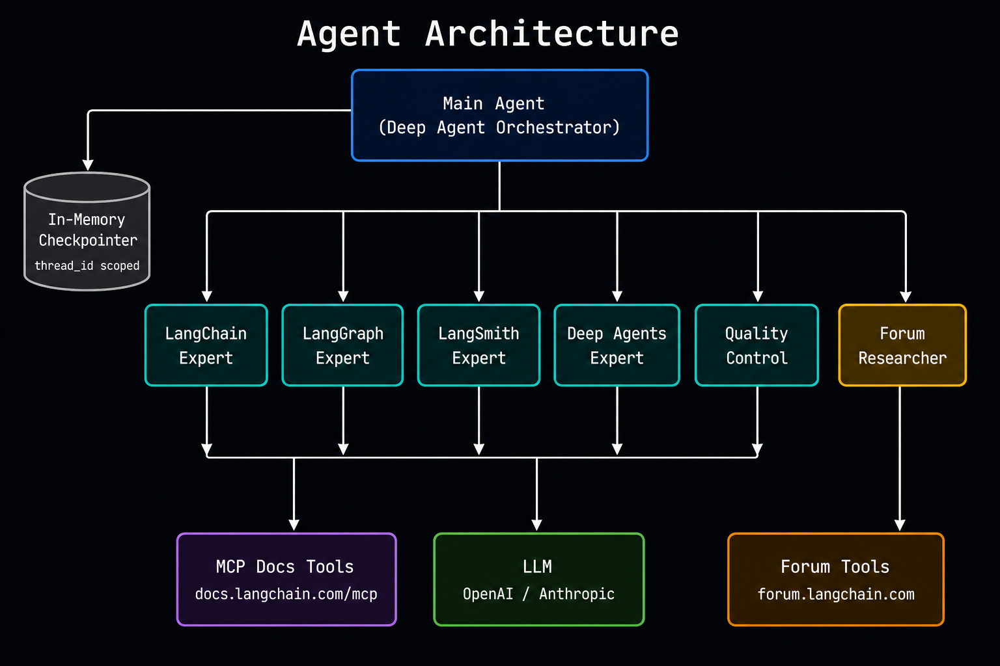
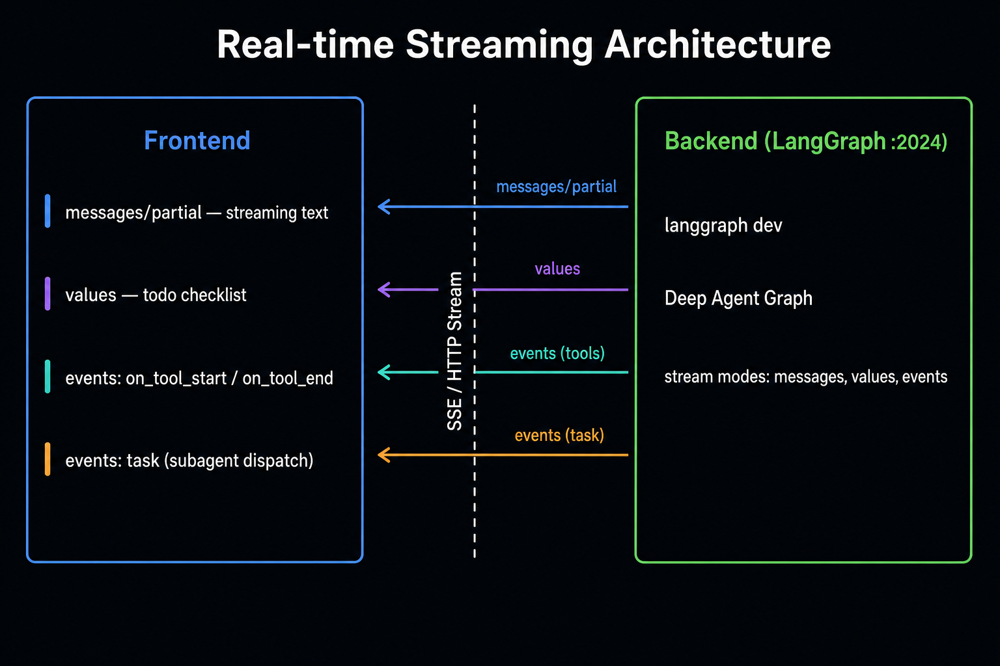

# langchain-docs-agent



An agent that answers questions about the **LangChain ecosystem** — LangChain, LangGraph, LangSmith, and Deep Agents — grounded in two live sources: the **[official docs MCP](https://docs.langchain.com/mcp)** and the **[LangChain community forum](https://forum.langchain.com)**. No vector database. No embedding pipeline. Just verified answers from the source, cross-checked against real community solutions.

---

## Agent Architecture

The agent is built on **[Deep Agents](https://docs.langchain.com/oss/python/deepagents/overview)** (`create_deep_agent`), which adds planning, multi-step orchestration, and subagent delegation on top of a standard tool-calling loop.



| Subagent | Responsibility |
| --- | --- |
| `langchain-expert` | LangChain agents, tools, RAG, retrieval, models, middleware |
| `langgraph-expert` | StateGraph, checkpointers, persistence, interrupts, streaming |
| `langsmith-expert` | Observability, tracing, evaluation, datasets, deployment |
| `deepagents-expert` | Deep Agents harness, subagents, planning, filesystem, skills |
| `quality-control` | Post-draft validation — grounding, API accuracy, citations |
| `forum-researcher` | Cross-checks answers against community threads on forum.langchain.com |

All subagents are instructed via [`utils/prompts.py`](langchain_docs_agent/utils/prompts.py) to **never invent APIs**, cite evidence from MCP output, and flag gaps when docs are silent.

---

## Frontend & Backend Architecture

The React SPA streams agent output in real-time over **SSE** using `@langchain/langgraph-sdk`. Four custom hooks orchestrate the full lifecycle; a `BroadcastChannel`-based layer keeps every open browser tab in perfect sync — no WebSocket server required.



| Hook | Responsibility |
| --- | --- |
| `useThreadList` | Fetch + refresh the conversation list |
| `useThreadState` | Load persisted thread history via `threads.getState` |
| `useThreadRuns` | Own the live SSE stream; multiplex `messages-tuple`, `updates`, `events`, `tasks`, `debug`, `values` into streaming text + agent steps |
| `useCrossTabSync` | BroadcastChannel relay — `run_progress`, `user_pending`, `thread_list_changed`, `run_started/finished` keep all tabs identical in real-time |

The **LangGraph Agent Server** runs as a Docker container via `langgraph up` on `:8123`. Vite proxies `/langgraph/*` to it in development so the UI and agent server run on separate ports without CORS issues.

---

## Setup & Running

### Prerequisites

| Requirement | Notes |
| --- | --- |
| [uv](https://docs.astral.sh/uv/) | Python deps + `langgraph` CLI |
| Node.js + npm | Vite/React UI in `frontend/` |
| [Docker](https://docs.docker.com/get-docker/) | Required by `langgraph up` to run the agent server |

You also need an LLM provider API key. Set **`OPENAI_API_KEY`** or **`ANTHROPIC_API_KEY`** depending on which model you choose.

### First-time setup

```bash
# 1. Clone and enter the repo
git clone <repo-url> && cd langchain-docs-agent

# 2. Configure environment
cp .env.example .env
# Edit .env — set DOCS_AGENT_MODEL and the matching API key

# 3. Install Python dependencies
make sync

# 4. Install frontend dependencies
make frontend-install
```

### Run

```bash
# Backend + frontend together (recommended)
make up-all
```

Then open **http://localhost:5173**.

| Service | URL |
| --- | --- |
| Web UI (Vite) | http://localhost:5173 |
| LangGraph Agent Server | http://localhost:8123 |

**Two-terminal alternative:**

```bash
# Terminal 1 — agent server (Docker)
make up

# Terminal 2 — web UI
make frontend-dev
```

### Environment variables

| Variable | Purpose |
| --- | --- |
| `DOCS_AGENT_MODEL` | Model id, e.g. `anthropic:claude-sonnet-4-6` |
| `OPENAI_API_KEY` / `ANTHROPIC_API_KEY` | Provider key matching the model prefix |
| `LANGCHAIN_DOCS_MCP_URL` | Optional. Defaults to `https://docs.langchain.com/mcp` |
| `LANGCHAIN_API_KEY` / `LANGCHAIN_TRACING_V2` | Optional LangSmith tracing |

---

## Roadmap

| Status | Item | Description |
| --- | --- | --- |
| 🔜 | **Animated concept explainers** | Auto-generate step-by-step SVG/canvas animations for complex topics (e.g. how LangGraph checkpointing works, how a StateGraph executes), rendered inline in the chat response |
| 🔜 | **Video tutorial generation** | Convert agent answers into narrated screencasts — slide deck + voiceover — exported as MP4, covering code walkthroughs and multi-step workflows |
| 🔜 | **Audio tutorials** | Text-to-speech synthesis of answers so users can listen to documentation explanations hands-free; downloadable as MP3 with chapter markers |


## License

See [LICENSE](LICENSE).
